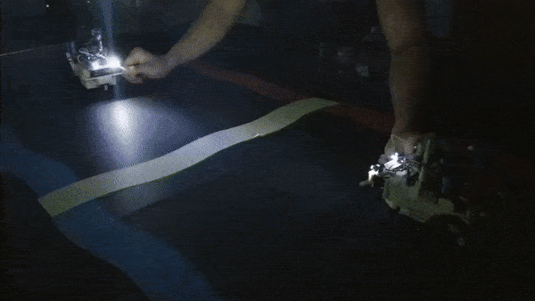

# Junior Design - Autonomous Cars 
## Teams Greige and Zinnobar

Junior design is a course that undergraduate Electrical and Computer Engineers take at Tufts that is intended to prepare them for the real world of product design. In the course, students are given unclear spec sheets, a 

# Challenges
## Challenge 1


## Challenge 2


```c
/* excerpt from program.h */
// CHALLENGE 2 BOT 1 ------------------------------------------------------
    {THREAD_3, 1,  {listen,     &c2b1_rcv_500ms}},        // receive 500ms message
    {THREAD_3, 5,  {move_time,  &c2b1_fwd_12in}},         // move forward 12
    {THREAD_3, 8,  {flashled,   &c2b1_flash_head}},       // 
    {THREAD_3, 10, {move_time,  &c2b1_stop_1}},           // STOP #1
    {THREAD_3, 15, {move_time,  &c2b1_turn_180}},         // Turn around 180
    {THREAD_3, 20, {move_time,  &c2b1_back_3}},           // Backwards 3
    {THREAD_3, 25, {move_time,  &c2b1_stop_2}},           // STOP #2
    {THREAD_3, 30, {move_time,  &c2b1_left_90}},          // Turn left 90
    {THREAD_3, 35, {move_time,  &c2b1_right_1}},          // Turn right 
    {THREAD_3, 40, {move_time,  &c2b1_lightstop_1}},      // Light stop
    {THREAD_3, 45, {move_time,  &c2b1_right_2}},          // Turn right
    {THREAD_3, 50, {move_time,  &c2b1_lightstop_2}},      // Light stop
    {THREAD_3, 55, {move_time,  &c2b1_right_3}},          // Turn right 
    {THREAD_3, 60, {move_time,  &c2b1_back_to_start}},    // Do your best to MOVE TO START
    {THREAD_3, 65, {talk,       &c2b1_send_500ms}},       // Send 500ms message to Bot 2 (stop auto)
```

## Challenge 3


```c
    /* excerpt from program.h */
    // CHALLENGE 3 BOT 1 ------------------------------------------------------
    {THREAD_5, 1,  {move_time,  &c3b1_wait_start}},
    {THREAD_5, 3,  {move_if,    &c3b1_forward_light}},    //move forward until light sensed
    {THREAD_5, 5,  {move_time,  &c3b1_stop_5s}},          //stop 5 seconds
    {THREAD_5, 10, {talk,       &c3b1_send_500ms}},
    {THREAD_5, 15, {flashled,   &c3b1_flash_head_twice}},
    {THREAD_5, 20, {flashled,   &c3b1_illuminate_turnL}},
    {THREAD_5, 25, {flashled,   &c3b1_illuminate_turnR}},
```


Contributers:
- Ashton Stephens
- Liam Crowley
- Ashish Neupane
- Aji Sjamsu
- Joseph Meng
- Victor Dinh

